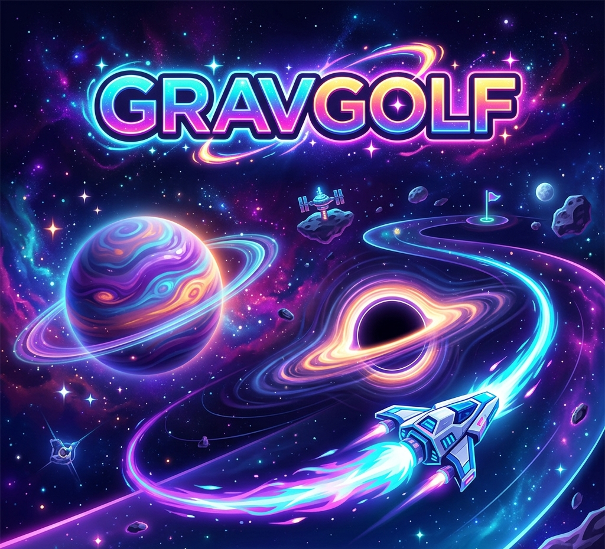
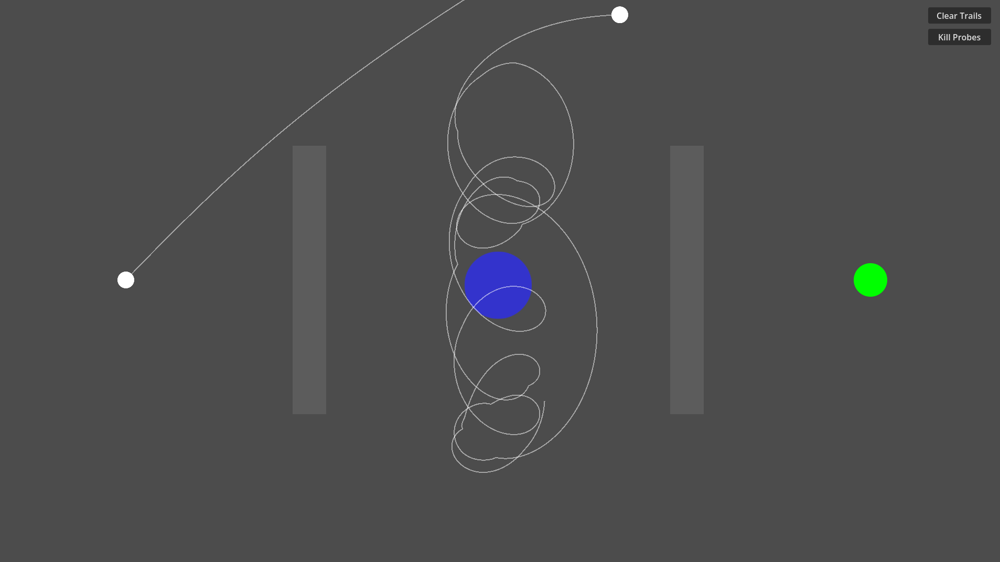
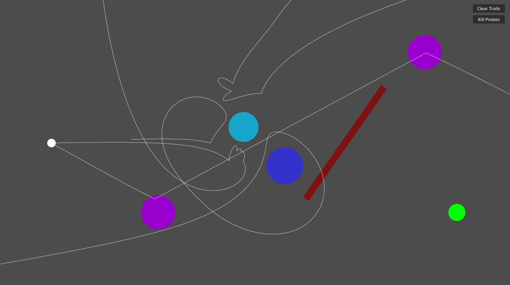

# David Crawford
## Current Projects

# GravGolf

  

  # GravGolf

  **A 2D physics-based puzzle game where you use gravity to guide your probe home.**

  

  <!-- # [Play on Itch.io](#) • [Download Releases](#) -->

---

## 🌌 About The Game

**GravGolf** is a 2D mini-golf style game set in space. Instead of swinging a club, you launch probes into the void, utilizing the gravitational pull of celestial bodies to bend your trajectory and reach the target. 

  <video src="./docs/assets/GravGolf/GravGolf level clip.mp4" alt="GravGolf Gameplay Loop" width="80%" autoplay loop muted>

## ✨ Key Features

* **Newtonian Physics Engine:** Gravity isn't just a suggestion. Utilize Godot's 2D physics engine to slingshot around planets.
* **Lethal Black Holes:** Watch out for event horizons! Black holes will destroy your probe on contact.
* **Intuitive Controls:** Simple drag-and-release aiming with visual trajectory lines to plan your perfect shot.
* **Persistent Trails:** Your previous attempts leave trails, allowing you to learn from your mistakes and adjust your vectors.
* **Level Editor:** Create and share your own levels!

## 🎮 How to Play

  

1. **Aim:** Click and drag anywhere on the screen to draw your launch vector.
2. **Launch:** Release the mouse button to fire the probe.
3. **Navigate:** Watch as gravity alters your path. You might need to bounce off safe surfaces or narrowly miss a black hole to reach the target!
4. **Iterate:** If you crash or fly off-screen, your trail remains. Try again with a slightly adjusted angle or power!

## 📸 Screenshots

|  |  |
|:---:|:---:|
| *Moving planets* | *Navigate complex planetary clusters* |

## 🛠️ Development & Building

GravGolf is built using [Godot Engine 4](https://godotengine.org/).
